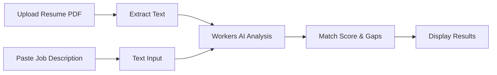

# 📄 Resume Parser & Matcher

A simple tool that compares a resume PDF against a job description PDF and provides a match analysis with actionable feedback.

---

## 🎯 Overview

Upload a resume PDF and paste a job description — get instant matching analysis powered by free AI. No accounts, no database, just results.

### Key Features

- **PDF Upload**: Drag & drop resume PDF
- **Text Input**: Paste job description from any job posting
- **AI-Powered Matching**: Uses Workers AI (Llama 3) for free analysis
- **Instant Results**: No storage, no accounts — stateless operation
- **Gap Analysis**: See what skills/experience are missing
- **Match Score**: Get a percentage match with breakdown

---

## 📋 How It Works



1. User uploads resume PDF + pastes job description text
2. Next.js API route extracts text from PDF
3. Both texts sent to Cloudflare Workers AI for analysis
4. AI returns structured match analysis
5. Results displayed immediately — nothing stored

---

## 🏗️ Technical Architecture

```mermaid
flowchart TB
    subgraph Client["Next.js Frontend"]
        UI[Upload UI]
        RES[Results View]
    end
    
    subgraph API["Next.js API Routes"]
        UPLOAD[/api/match]
        PARSE[PDF Parser]
    end
    
    subgraph External["Cloudflare"]
        AI[Workers AI - Llama 3]
    end
    
    UI --> UPLOAD
    UPLOAD --> PARSE
    PARSE --> AI
    AI --> RES
```

---

## 🛠️ Tech Stack

| Layer | Technology | Purpose |
|-------|------------|---------|
| **Framework** | Next.js 14 (App Router) | Full-stack React |
| **Language** | TypeScript | Type safety |
| **Styling** | Tailwind CSS | Responsive design |
| **PDF Parsing** | `pdf-parse` | Extract text from resume |
| **AI** | Workers AI (Llama 3) | Free matching analysis |
| **Deployment** | Vercel | Free hosting |

> **💡 Cost**: Completely free — Vercel free tier + Workers AI free tier!

---

## 📁 Project Structure

```
resume-parser-matcher/
├── app/
│   ├── page.tsx                # Upload UI
│   ├── layout.tsx              # Root layout
│   ├── globals.css             # Tailwind styles
│   ├── results/
│   │   └── page.tsx            # Results display
│   └── api/
│       └── match/
│           └── route.ts        # PDF parsing + AI matching
│
├── components/
│   ├── upload-dropzone.tsx     # Drag & drop for resume PDF
│   ├── job-textarea.tsx        # Text input for job description
│   ├── match-results.tsx       # Score + gaps display
│   └── loading-spinner.tsx     # Processing state
│
├── lib/
│   ├── pdf-parser.ts           # PDF text extraction
│   └── workers-ai.ts           # Cloudflare AI client
│
├── tailwind.config.js
├── next.config.js
├── package.json
└── README.md
```

---

## 🚀 Getting Started

### Prerequisites

- Node.js 18+
- Cloudflare account (free, for Workers AI)

### Installation

```bash
# Clone repository
git clone https://github.com/yourusername/resume-parser-matcher.git
cd resume-parser-matcher

# Install dependencies
npm install

# Start development server
npm run dev
```

### Environment Variables

Create a `.env.local` file:

```env
# Cloudflare Workers AI
CLOUDFLARE_ACCOUNT_ID=your-account-id
CLOUDFLARE_API_TOKEN=your-api-token
```

### Get Cloudflare API Token

1. Go to [Cloudflare Dashboard](https://dash.cloudflare.com/)
2. Click on your account → **AI** → **Workers AI**
3. Get your **Account ID** from the URL or sidebar
4. Create an API token: **My Profile** → **API Tokens** → **Create Token**
5. Use the "Workers AI" template or create custom with `Workers AI: Read` permission

---

## 📊 API Endpoint

### `POST /api/match`

**Request**: `multipart/form-data`
- `resume`: PDF file (required)
- `jobDescription`: string (required)

**Response**:
```json
{
  "score": 78,
  "summary": "Strong match with some gaps in cloud experience",
  "strengths": [
    "5+ years TypeScript experience matches requirement",
    "React expertise aligns with frontend needs",
    "Previous startup experience is a plus"
  ],
  "gaps": [
    "Missing AWS certification mentioned in requirements",
    "No Kubernetes experience listed",
    "Job requires 3+ years Python, resume shows 1 year"
  ],
  "suggestions": [
    "Highlight any cloud platform experience in cover letter",
    "Mention containerization experience if any",
    "Consider AWS certification to strengthen application"
  ]
}
```

---

## 💻 Code Examples

### Workers AI Client

```typescript
// lib/workers-ai.ts
const CLOUDFLARE_API = 'https://api.cloudflare.com/client/v4/accounts';

export async function analyzeMatch(resumeText: string, jobText: string) {
  const response = await fetch(
    `${CLOUDFLARE_API}/${process.env.CLOUDFLARE_ACCOUNT_ID}/ai/run/@cf/meta/llama-3-8b-instruct`,
    {
      method: 'POST',
      headers: {
        'Authorization': `Bearer ${process.env.CLOUDFLARE_API_TOKEN}`,
        'Content-Type': 'application/json',
      },
      body: JSON.stringify({
        messages: [
          {
            role: 'system',
            content: `You are a resume matching expert. Compare the resume against the job description.
              Return JSON with: { score (0-100), summary, strengths: [], gaps: [], suggestions: [] }`
          },
          {
            role: 'user',
            content: `RESUME:\n${resumeText}\n\nJOB DESCRIPTION:\n${jobText}`
          }
        ],
        max_tokens: 1024
      })
    }
  );

  const data = await response.json();
  return JSON.parse(data.result.response);
}
```

### API Route

```typescript
// app/api/match/route.ts
import { NextResponse } from 'next/server';
import pdf from 'pdf-parse';
import { analyzeMatch } from '@/lib/workers-ai';

export async function POST(request: Request) {
  const formData = await request.formData();
  
  const resumeFile = formData.get('resume') as File;
  const jobDescription = formData.get('jobDescription') as string;
  
  // Extract text from resume PDF
  const resumeBuffer = Buffer.from(await resumeFile.arrayBuffer());
  const resumeData = await pdf(resumeBuffer);
  
  // Analyze with Workers AI
  const result = await analyzeMatch(resumeData.text, jobDescription);
  
  return NextResponse.json(result);
}
```

---

## 🎨 UI Preview

The app features a clean, modern interface:

1. **Upload Page**: 
   - Left side: Dropzone for resume PDF
   - Right side: Textarea for pasting job description
2. **Processing State**: Loading animation while AI analyzes
3. **Results Page**: 
   - Match score displayed as a circular progress indicator
   - Strengths listed with green checkmarks
   - Gaps listed with orange warning icons
   - Actionable suggestions for improvement

---

## 🧪 Testing

```bash
npm run test        # Unit tests
npm run test:e2e    # Playwright tests
```

---

## 🚢 Deployment

### Deploy to Vercel

```bash
# One-click deploy
npx vercel

# Or connect GitHub repo to Vercel for auto-deploys
```

Remember to add environment variables in Vercel dashboard:
- `CLOUDFLARE_ACCOUNT_ID`
- `CLOUDFLARE_API_TOKEN`

---

## 📈 Future Enhancements

- [ ] Support DOCX files
- [ ] Multiple resume comparison
- [ ] Download results as PDF
- [ ] Cover letter generator based on gaps
- [ ] Browser extension for job sites

---

## 📄 License

MIT License - See [LICENSE](LICENSE) for details.
